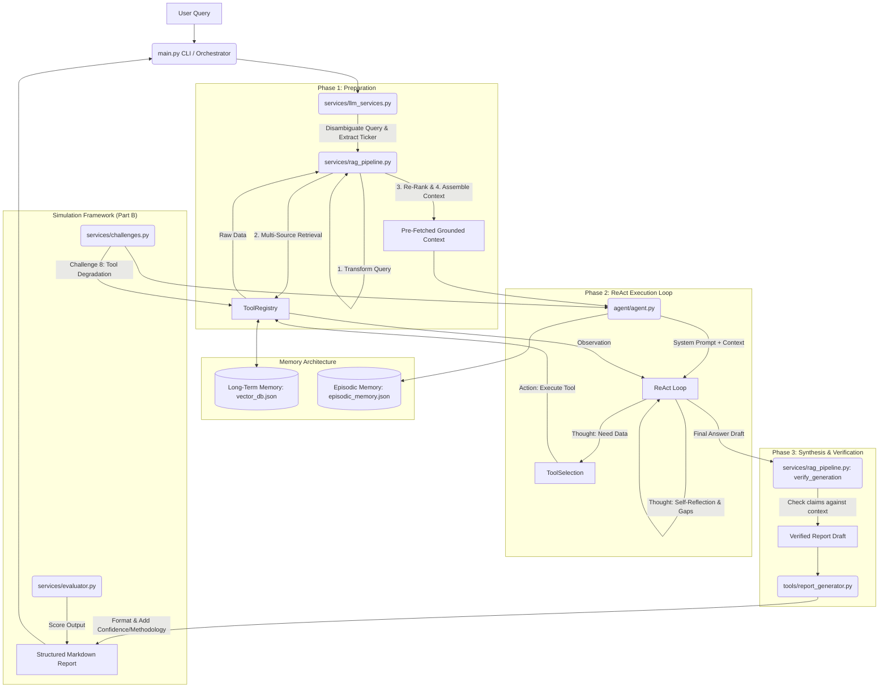

# ARA-1 Autonomous Financial Research Agent: Architecture Specification

## 1. Executive Summary

The ARA-1 (Autonomous Research Agent 1) is a sophisticated, autonomous financial research system designed to emulate the workflow and output quality of a junior financial analyst. It is built to process natural language queries, autonomously gather structured and unstructured financial data, verify its findings, and produce comprehensive, professional-grade investment research reports.

**Core Technologies:**
*   **LLM Engine:** Groq API leveraging `llama-3.1-8b-instant` for high-speed, cost-effective reasoning and generation.
*   **Execution Pattern:** LangChain-style **ReAct** (Reasoning + Acting) loop combined with a multi-stage **RAG** (Retrieval-Augmented Generation) pipeline.
*   **Memory Architecture:** A 3-layer system incorporating short-term context window management, persistent vector-based long-term memory, and episodic tracking for strategy optimization.

## 2. System Architecture Diagram

## 3. Core Components

### 3.1 Agent Orchestrator (`agent/agent.py`)
The central nervous system of ARA-1. It manages the ReAct execution loop, which allows the agent to reason about what information it needs, act by calling tools, and observe the results before making its next decision.
*   **Prompt Engineering Patterns:** Implements Chain-of-Verification (requiring a fact-check step before finalization), Self-Reflection (mandatory gap and confidence assessment), and Structured Output (enforcing a specific report template).
*   **State Management:** Manages the `MAX_STEPS` (12) and `MAX_TOOL_CALLS` (8) budgets, summarising short-term memory when context limits are reached to maintain LLM focus.
*   **Tool Degradation Support:** Includes global flags (`TOOL_DEGRADATION_RATE`) to simulate real-world API failures for robustness testing (used in Challenge 8).

### 3.2 RAG Pipeline (`services/rag_pipeline.py`)
A comprehensive 6-stage Retrieval-Augmented Generation pipeline designed to eliminate hallucination by grounding the agent in verified data before the ReAct loop even begins.
*   **Stage 1: Query Transformation:** Uses the LLM to decompose a complex user query into 3-5 specific, targeted sub-queries.
*   **Stage 2: Multi-Source Retrieval:** Dispatches sub-queries simultaneously to the internal vector database, financial APIs, company profile endpoints, and news sentiment tools.
*   **Stage 3: Relevance Re-Ranking:** Uses TF-IDF cosine similarity scoring, combined with a hardcoded source reliability tier weight, to filter and rank results.
*   **Stage 4: Context Assembly:** Compiles the top results into a token-budgeted context block, enforcing source diversity and recency weighting, with strict source attribution tags.
*   **Stage 5: Grounded Generation:** Managed by the core Agent prompt, ensuring claims are tied to the assembled context.
*   **Stage 6: Post-Generation Verification:** A secondary LLM pass that cross-references every factual claim in the generated draft against the original retrieved context, appending a verification note to the final report.

### 3.3 LLM Services (`services/llm_services.py`)
Provides the interface to the Groq API and specific pre-processing functions.
*   **`disambiguate_query`:** Handles ambiguous inputs (e.g., "What's happening with banks?"), extracts tickers, identifies temporal context, and classifies the query type to optimize downstream tool selection.

## 4. Tool Registry (`tools/`)

The agent has access to 12 distinct tools, organized by reliability and purpose. The system prompt enforces a strict source hierarchy, prioritizing Tier 1 and 2 sources over Tier 3 and 4.

| Tool Name | Type | Tier | Purpose |
| :--- | :--- | :---: | :--- |
| `sec_filing_search` | Data | 1 | Retrieves raw, legally audited text from SEC 10-K, 10-Q, and 8-K filings. |
| `financial_data_api` | Data | 2 | Fetches structured financial statements, income, balance sheets, cash flows, and key ratios. |
| `company_profile` | Data | 2 | Retrieves static company overview data (sector, industry, CEO, market cap). |
| `earnings_transcript` | Analysis | 3 | Fetches earnings call transcripts for management commentary and forward guidance. |
| `peer_comparison` | Analysis | 2/3 | Compares specific financial metrics of a target company against a defined number of sector peers. |
| `calculation_engine` | Analysis | N/A | Performs deterministic financial math (growth rates, CAGR, basic DCF) to avoid LLM calculation hallucinations. |
| `news_sentiment` | Search | 4 | Aggregates recent news articles and provides a synthesized sentiment score. |
| `web_search_tool` | Search | 4 | General web search using DuckDuckGo (restricted from being used for financial numbers). |
| `fact_checker` | Verification| N/A | Validates specific claims against provided sources or the web using keyword overlap heuristics. |
| `report_generator` | Output | N/A | Formats final markdown reports, adding professional headers, auto-detecting data gaps, and scoring section confidence. |
| `vector_db_search` | Memory | Variable| Searches long-term memory for past research. |
| `vector_db_store` | Memory | N/A | Saves completed analysis and retrieved chunks to long-term memory. |

## 5. Memory Architecture

ARA-1 employs a 3-layer memory system to maintain context and learn over time.

1.  **Short-Term Memory (Context Window):** Maintained within the `agent.py` ReAct loop. Uses an intelligent summarization algorithm (`_summarize_short_term_memory`) to compress older observation blocks while preserving the system prompt, original query, and the most recent tool calls, preventing context overflow.
2.  **Long-Term Memory (`vector_db.json`):** A lightweight, JSON-backed vector database using Scikit-learn's TF-IDF for semantic search.
    *   **Enriched Schema:** Documents are stored with metadata including `ticker`, `source_type`, `date`, `confidence` score, and a `verified` boolean.
    *   **Chunking Strategy:** Tailored chunking algorithms for different data types (e.g., splitting transcripts by speaker turns, SEC filings by sections).
3.  **Episodic Memory (`episodic_memory.json`):** Tracks the success or failure of specific tool calls and overall research sessions. This data is fed back into the agent's system prompt (e.g., "Tool reliability from past sessions:...") to guide future tool selection strategy.

## 6. Simulation & Evaluation Framework (Part B)

The repository includes a gamified testing environment to validate the agent's performance.

*   **Challenge Runner (`services/challenges.py`):** Defines 8 distinct research scenarios of increasing difficulty (from basic company profiles to handling contradictory data and ambiguous queries). Challenge 8 introduces simulated API degradation (50% failure rate) to test the agent's fallback mechanisms.
*   **Research Quality Board Evaluator (`services/evaluator.py`):** An LLM-based evaluation panel that scores agent outputs on a 0-10 scale based on 3 distinct personas:
    *   *Dr. Sarah Chen (40% weight):* Focuses strictly on factual accuracy, numerical correctness, and source citations.
    *   *Marcus Thompson (35% weight):* Evaluates analytical depth, original insights, and the presence of a coherent thesis beyond mere data summarization.
    *   *Priya Sharma (25% weight):* Assesses system architecture, tool efficiency, handling of data gaps, and report structure.
    *   Produces a final letter grade and maintains a persistent leaderboard (`outputs/challenge_scores.json`).

## 7. Execution Interfaces (`main.py`)

The primary entry point provides two modes of operation:
1.  **Interactive Mode (`python main.py`):** A REPL-style interface for continuous, ad-hoc research queries.
2.  **Challenge Mode:** Automated testing and evaluation.
    *   `python main.py challenge <1-8>`: Runs a specific challenge and auto-evaluates it.
    *   `python main.py challenge all`: Runs all 8 challenges sequentially.
    *   `python main.py challenge evaluate`: Runs the RQB evaluator on all completed challenge outputs.
    *   `python main.py challenge score`: Displays the current evaluation leaderboard.
